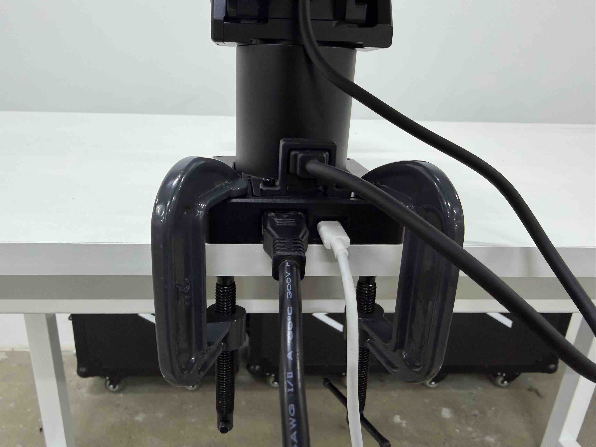
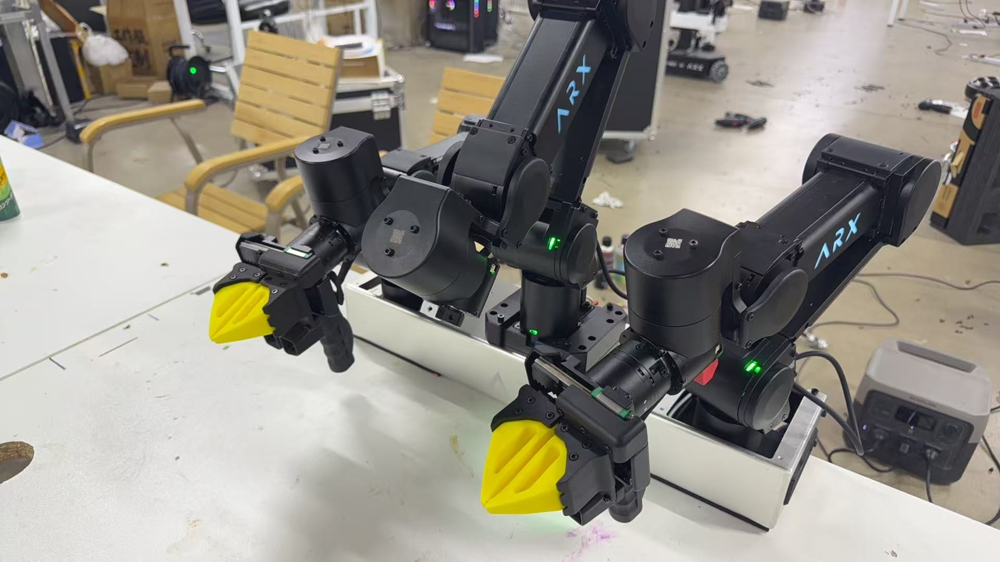
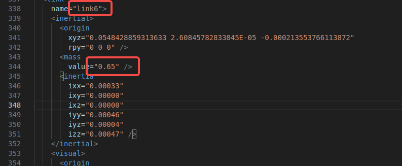
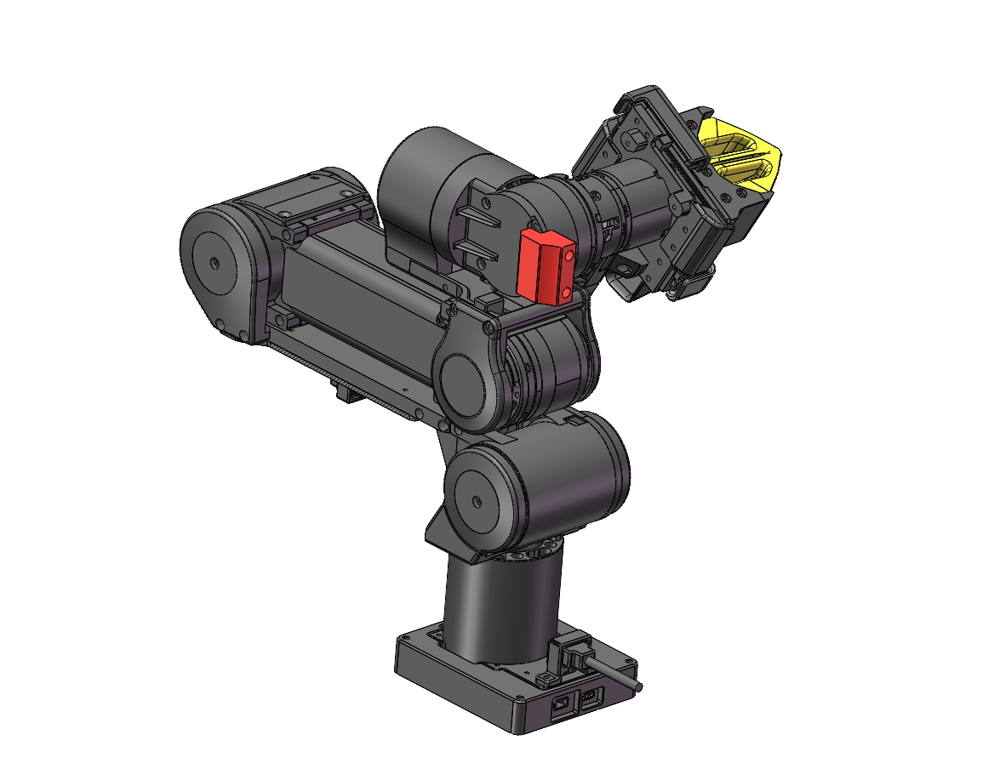
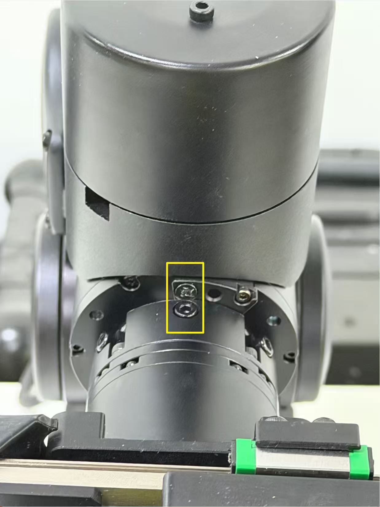

# ARX A5 机械臂 + ROS 环境完整安装指南

涵盖:
- Python 环境选择(系统全局 / Conda 隔离)
- 用 RoboStack 在 Conda 中搭建 ROS 环境(Ubuntu 20.04 + ROS 1 Noetic / Ubuntu 22.04 + ROS 2 Humble)
- ARX A5 Python SDK 安装(硬件连接、CAN 配置、SDK 编译)
- VS Code 集成终端的常见坑
- ARX 机械臂校准(含 J6 校准对齐说明)

---

## 前序：硬件连接

无论走哪条路线,先把硬件接好。

按 ARX 出厂文档把电源、CAN 通讯线、夹爪线缆按图示插好(USB-CAN 接到主控)。


---

## 安装路线选择

**先决定你要哪种 Python 环境**,再开始装 SDK。两条路二选一:

### 路线 A:系统全局安装(简单直接)

适合:
- 这台机器**只用来跑 ARX**,不混跑其他项目
- 不需要多个 Python 版本隔离
- Ubuntu 20.04 系统自带 Python 3.8 + 系统 ROS Noetic 已经够用

优点:简单,没有环境切换的概念。
缺点:依赖装在系统层,删除/迁移麻烦,容易和别的项目互相污染。

→ 跳到 **第一部分:系统全局准备**

### 路线 B:Conda 环境(推荐,隔离干净)

适合:
- 这台机器要跑多个项目,需要环境隔离
- 想用 Python 3.9/3.10/3.11(而不是系统的 3.8)
- 项目要在多台机器迁移
- 后续可能升级到 ROS 2

优点:隔离干净,删除环境只要 `conda env remove`,跨机器迁移容易。
缺点:多一层学习成本,首次配置稍复杂。

→ 跳到 **第二部分:Conda + RoboStack 准备**

---

## 第一部分:系统全局准备(路线 A)

### 1.1 装系统 ROS Noetic

如果还没装,按 ROS 官方教程装:<http://wiki.ros.org/noetic/Installation/Ubuntu>

简版命令:

```bash
sudo sh -c 'echo "deb http://packages.ros.org/ros/ubuntu $(lsb_release -sc) main" > /etc/apt/sources.list.d/ros-latest.list'
sudo apt install curl
curl -s https://raw.githubusercontent.com/ros/rosdistro/master/ros.asc | sudo apt-key add -
sudo apt update
sudo apt install ros-noetic-desktop-full -y

# 自动 source
echo "source /opt/ros/noetic/setup.bash" >> ~/.bashrc
source ~/.bashrc
```

### 1.2 装 Python 基础依赖

```bash
sudo apt install python3-pip python3-rosdep python3-rosinstall \
                 python3-rosinstall-generator python3-wstool build-essential
```

→ 完成后跳到 **第三部分:ARX A5 SDK 安装**

---

## 第二部分:Conda + RoboStack 准备(路线 B)

### 为什么要用 RoboStack 而不是系统 ROS + conda

直接用系统 ROS + conda 经常遇到这些问题:

- conda 环境的 Python 版本和 ROS 编译时的 Python 版本不一致(比如 Noetic 是 3.8,你的 conda 是 3.9)→ `import PyKDL` 这类 C 扩展直接挂掉
- 需要在每个 conda 环境里手动 `unset CMAKE_PREFIX_PATH`、写 `activate.d` 脚本、source 一堆 setup.bash,容易和别的项目残留环境变量打架
- 每次新建 conda 环境都要重复一遍配置,换机器更痛苦

**RoboStack** 把整个 ROS 打包成 conda 包,所有东西装在 conda 环境里,不依赖系统 ROS,Python 版本随便选。

### 2.1 装 Miniconda

如果还没装:

```bash
wget https://repo.anaconda.com/miniconda/Miniconda3-latest-Linux-x86_64.sh
bash Miniconda3-latest-Linux-x86_64.sh
# 一路 enter / yes
source ~/.bashrc   # 或 source ~/.zshrc
conda --version    # 验证
```

### 2.2 通用准备:关闭已有的系统 ROS 自动加载

如果 `~/.bashrc` 或 `~/.zshrc` 里加过 `source /opt/ros/.../setup.bash` 之类的行,**必须先注释掉**,否则环境变量会污染 conda 环境。

```bash
# zsh 用户
grep -n "ros/.*setup" ~/.zshrc

# bash 用户
grep -n "ros/.*setup" ~/.bashrc

# 假设在第 145 行,注释掉
sed -i '145s|^|# |' ~/.zshrc
```

---

### 2.3 场景 A:Ubuntu 20.04 + ROS 1 (Noetic)

**ARX A5 当前主推配置,官方 SDK 基于 Noetic 测试,推荐用这个组合。**

#### 步骤 1:创建环境

```bash
conda create -n robo_ctrl python=3.9 -y
conda activate robo_ctrl
```

> Python 版本可选 3.9 / 3.10 / 3.11,这里用 3.9 兼容性最好。

#### 步骤 2:配置 conda channel

```bash
conda config --env --add channels conda-forge
conda config --env --add channels robostack-staging
conda config --env --remove channels defaults 2>/dev/null
```

> 用 `--env` 让配置只对当前环境生效,不污染全局 `~/.condarc`。

#### 步骤 3:安装 ROS Noetic

```bash
conda install ros-noetic-desktop -y
```

只要 core 不要 rviz/rqt:

```bash
conda install ros-noetic-ros-base -y
```

#### 步骤 4:安装常用开发工具

```bash
conda install compilers cmake pkg-config make ninja \
              colcon-common-extensions catkin_tools rosdep -y
```

#### 步骤 5:安装项目用到的 ROS 包

按需添加,例如:

```bash
conda install ros-noetic-kdl-parser-py \
              ros-noetic-urdfdom-py \
              ros-noetic-tf2-ros \
              ros-noetic-cv-bridge -y
```

完整包列表:<https://robostack.github.io/noetic.html>

#### 步骤 6:重新激活并验证

```bash
conda deactivate
conda activate robo_ctrl

which roscore                    # 应在 ~/miniconda3/envs/robo_ctrl/bin/
echo $ROS_DISTRO                 # noetic
python -c "import rospy; import PyKDL; print('OK')"
```

→ 完成后跳到 **第三部分:ARX A5 SDK 安装**

---

### 2.4 场景 B:Ubuntu 22.04 + ROS 2 (Humble)

> ⚠️ **警告**:ARX 当前 SDK 是为 ROS 1 设计的。如果你坚持在 Ubuntu 22.04 上用 ARX,有两个选择:
>
> 1. **(推荐)在 22.04 上装 Noetic 的 RoboStack**(RoboStack 支持跨发行版),按 2.3 节走
> 2. 装 Humble,自己写 ros2 节点封装 SDK,不依赖 ARX 官方 ROS 包
>
> 下面这套是 Humble 的标准流程,适合纯 ROS 2 开发(不一定专门给 ARX)。

#### 步骤 1:创建环境

```bash
conda create -n robo_ctrl_ros2 python=3.10 -y
conda activate robo_ctrl_ros2
```

> Humble 官方对齐 Python 3.10。

#### 步骤 2:配置 channel

```bash
conda config --env --add channels conda-forge
conda config --env --add channels robostack-staging
conda config --env --remove channels defaults 2>/dev/null
```

#### 步骤 3:安装 ROS 2 Humble

```bash
conda install ros-humble-desktop -y
```

精简版:

```bash
conda install ros-humble-ros-base -y
```

#### 步骤 4:安装开发工具

```bash
conda install compilers cmake pkg-config make ninja \
              colcon-common-extensions rosdep -y
```

> ROS 2 不需要 `catkin_tools`,只用 colcon。

#### 步骤 5:安装项目包

```bash
conda install ros-humble-kdl-parser-py \
              ros-humble-tf2-ros \
              ros-humble-cv-bridge \
              ros-humble-rviz2 -y
```

完整包列表:<https://robostack.github.io/humble.html>

#### 步骤 6:激活验证

```bash
conda deactivate
conda activate robo_ctrl_ros2

echo $ROS_DISTRO                 # humble
ros2 --help
python -c "import rclpy; print('OK')"
```

#### 步骤 7:测试通信

```bash
ros2 run demo_nodes_cpp talker
# 另开一个终端
ros2 run demo_nodes_cpp listener
```

---


## 第三部分:ARX A5 Python SDK 安装

仓库地址:<https://github.com/ARXroboticsX/A5>

> ⚠️ **重要**:开始前先确认你已完成 **第一部分(路线 A)** 或 **第二部分(路线 B)**。SDK 编译时会绑定当时激活的 Python 解释器路径, 搞错环境会导致 `.so` 链接错 Python 版本。

### 3.1 进入正确的环境

**路线 A(系统全局)**:确保已 source ROS:

```bash
source /opt/ros/noetic/setup.bash
which python3   # 应该是 /usr/bin/python3
```

**路线 B(Conda)**:激活环境:

```bash
conda activate robo_ctrl
which python3   # 应该是 ~/miniconda3/envs/robo_ctrl/bin/python3
```

> 后续步骤在两条路线下命令完全一样。

### 3.2 系统基础环境配置

进入 SDK 的 `tools/` 目录,**按顺序**执行三个安装脚本(都是 ARX 提供的 shc 加密二进制):

```bash
cd A5/tools/
./01_global_nopasswd_sudo.sh.x        # 配置免密 sudo
./02install.x                          # 装 ARX 核心依赖
./03_install_common_packages.sh.x     # 装常用 apt 包
```

> ⚠️ 这三个脚本是**系统级**安装(往 `/usr/local`、`/etc/udev/rules.d` 写文件)。即便你在 conda 环境里执行,它们也会装到系统目录, 这是预期行为(udev 规则、CAN 工具本来就是系统级的)。

### 3.3 配置 CAN 设备

设备如未更换硬件, 只需配置一次即可。

#### 步骤 1:扫描设备序列号

```bash
cd A5/ARX_CAN/
./search
```

会输出形如:
```
ATTRS{serial}=="004800435547570820313031"
```

复制这串号码。

#### 步骤 2:写入 udev 规则

打开 `arx_can.rules`, 把复制的序列号填到对应行, 并起个别名(如 `arxcan1`):

```
SUBSYSTEM=="tty", ATTRS{idVendor}=="16d0", ATTRS{idProduct}=="117e", ATTRS{serial}=="004800435547570820313031", SYMLINK+="arxcan1"
```

保存后应用规则:

```bash
./set
```

对于双臂的情况, 可以断开当前连接的机械臂, 可以重复执行单臂的序列号查找和写入udev规则, 例如：
```bash
cd A5/ARX_CAN/
./search
```

第二条机械臂的序列号是：
```
ATTRS{serial}=="004800435547570820313032"
```
打开 `arx_can.rules`, 把复制的序列号填到对应行, 并起个别名(如 `arxcan3`, 这里推荐左臂`arxcan1`, 右臂`arxcan3`):

```
SUBSYSTEM=="tty", ATTRS{idVendor}=="16d0", ATTRS{idProduct}=="117e", ATTRS{serial}=="004800435547570820313031", SYMLINK+="arxcan1"
SUBSYSTEM=="tty", ATTRS{idVendor}=="16d0", ATTRS{idProduct}=="117e", ATTRS{serial}=="004800435547570820313032", SYMLINK+="arxcan3"
```

保存后应用规则:

```bash
./set
```

#### 步骤 3:启动指定 CAN

```bash
cd A5/ARX_CAN/
./arx_can1     # 启动 can1(对应你想用的编号)
```

启动成功后,`ip link show` 里能看到 `can1` 处于 `UP` 状态。

### 3.4 编译 SDK

确认你还在正确的环境里(系统或 conda),然后:

```bash
cd A5/
./build.sh
```

编译完会在 `bimanual/api/` 下生成 `arx_r5_python.cpython-XXX-x86_64-linux-gnu.so` 等动态库,以及 `libarx_r5a_src.so` 等运行时依赖库。

> 检查一下生成的 `.so` 文件名:`cpython-39` 表示 Python 3.9,`cpython-38` 表示 3.8。如果版本号和你的环境对不上,说明编译时用错 Python 了,需要回到 3.1 重来。

### 3.5 路线 B 专属:配置 ARX 动态库自动加载

> 这一步**只有 Conda 路线需要**。系统全局路线下,SDK 的 `setup.sh` 已经够用。

把 `LD_LIBRARY_PATH` 写进 conda activate.d,这样以后任何终端激活环境都能找到 ARX 库,不用每次手动 `source setup.sh`:

```bash
mkdir -p ~/miniconda3/envs/robo_ctrl/etc/conda/activate.d

# 把路径换成你的实际 ARX SDK 路径
cat > ~/miniconda3/envs/robo_ctrl/etc/conda/activate.d/arx.sh << 'EOF'
export LD_LIBRARY_PATH=/home/robotics/workspace/ARX_ARM/A5/bimanual/api:/home/robotics/workspace/ARX_ARM/A5/bimanual/api/arx_r5_src:$LD_LIBRARY_PATH
EOF

# 重新激活让它生效
conda deactivate
conda activate robo_ctrl

# 验证
echo $LD_LIBRARY_PATH | tr ':' '\n' | grep arx
```

### 3.6 运行测试

```bash
cd A5/
source ./setup.sh                # 路线 A 必须 source;路线 B 配过 activate.d 后可省略
python3 test_single_arm.py
```

看到 `ARX方舟无限` 不停打印就说明跑通了。

如果要运行双臂, 且没有head机械臂（如图所示）：


如果没有中间的head臂，则需要将`test_dual_arm.py`脚本中的`test_dual_arm`函数中的`single_arm_head`参数去掉后再运行。同样看到 `ARX方舟无限` 不停打印就说明跑通了。

---

## 第四部分:VSCode终端使用问题

**典型症状**:同样的代码在外部终端能跑,在 VS Code 集成终端报 `ImportError: libxxx.so: cannot open shared object file`,或者 `command not found`。

**根本原因**:VS Code 集成终端不一定继承你 shell 启动文件里设置的环境变量。常见情况:

- VS Code 默认用 bash,但你把环境变量写在了 `~/.zshrc` 里
- 某些环境变量是 login shell 才会读的(写在 `~/.zprofile` / `~/.bash_profile`),而 VS Code 启动的是 non-login shell
- 厂商 SDK 的 `setup.sh` 只对当前 shell session 生效,VS Code 的 shell 没跑过

### 4.1 排查方法

在外部终端和 VS Code 终端**分别**跑下面这条,对比输出:

```bash
echo $LD_LIBRARY_PATH
echo $PATH
echo $SHELL
```

差异最大的那个变量就是问题所在。

### 4.2 解决方案(Conda 路线最稳)

**第三部分 3.5 节** 已经讲过这种做法。无论从哪种 shell、哪种终端启动,只要激活环境就生效。

**系统全局路线**怎么办?可以把 `setup.sh` 的内容写进 `~/.bashrc` / `~/.zshrc`:

```bash
echo "source /home/robotics/workspace/ARX_ARM/A5/setup.sh" >> ~/.bashrc
```

但要小心和别的项目变量冲突,所以更建议用 Conda 路线。

### 4.3 让 VS Code 集成终端用 zsh

`Ctrl+Shift+P` → `Terminal: Select Default Profile` → 选 **zsh**。然后**完全关闭 VS Code 重开**(不只是关窗口,要完全 quit),让它重新读 zsh 配置。

### 4.4 让 VS Code 自动激活 conda 环境

在工作区或用户 `settings.json` 里加:

```json
{
  "python.defaultInterpreterPath": "~/miniconda3/envs/robo_ctrl/bin/python",
  "python.terminal.activateEnvironment": true
}
```

或者更简单:在 VS Code 右下角点 Python 解释器,选 `~/miniconda3/envs/robo_ctrl/bin/python`,之后新开终端会自动 `conda activate robo_ctrl`。

### 4.5 用 ldd 确认 .so 的所有依赖

如果加了 `LD_LIBRARY_PATH` 还是报错,说明这个 .so 还依赖别的找不到的库:

```bash
ldd /path/to/libxxx.so | grep "not found"
```

把每个 `not found` 的库的所在目录都加到 `LD_LIBRARY_PATH` 里。

---

## 第五部分:ARX A5 SDK 使用速查

激活环境后,Python 里直接用:

```python
from bimanual import SingleArm

arm_config = {"can_port": "can1", "urdf_name": "a5.urdf"}
arm = SingleArm(arm_config)
```

### 5.1 控制接口

| 功能 | API | 说明 |
|------|-----|------|
| 夹爪控制 | `set_gripper_pos(pos)` | 范围 0 ~ -3.14 |
| 末端位姿(四元数) | `set_ee_pose(pos, quat)` | quat 顺序 wxyz |
| 末端位姿(欧拉角) | `set_ee_pose_xyzrpy(xyzrpy)` | |
| 关节位置(底层重力补偿) | `set_joint_positions(positions)` | |
| 电机 MIT 协议 | `mit_joint_control(id, kp, kd, pos, vel, torque)` | 底层电机控制 |
| 重力补偿(示教模式) | `gravity_compensation()` | 进入后可手动拖动 |

### 5.2 状态反馈

| 功能 | API |
|------|-----|
| 关节位置 | `get_joint_positions()` |
| 关节速度 | `get_joint_velocities()` |
| 关节扭矩(电流) | `get_joint_currents()` |
| 末端位姿(四元数) | `get_ee_pose()` 返回 `[x, y, z, qw, qx, qy, qz]` |
| 末端位姿(欧拉角) | `get_ee_pose_xyzrpy()` |
| 正运动学 | `forward_kinematics()` |

### 5.3 末端质量调整

如果在末端装了夹爪/相机/工具,需要修改 `bimanual/script/a5.urdf` 里 `link6` 的 `<mass value="0.65" />`,改成实际质量(单位 kg)。**保存后重启程序生效**。否则重力补偿会不准。


---

## 第六部分:校准

> ⚠️ **非必要不要校准**。机械臂出厂已校准,只有在拆装/碰撞/精度异常时才需要重新校准。

### 6.1 校准前置条件

- 校准**仅在 CAN1 时生效**。如果你的臂不是 can1,需要临时改成 can1,校准完再改回去。
- 准备好校准位姿(见下文)。

### 6.2 J1~J5 校准

把机械臂摆放到标准位置(关节呈特定姿态,具体看 ARX 出厂文档里的姿势图):


```bash
cd A5/ARX_CAN/
./J1-5cali
```

### 6.3 J6 校准(单独水平校准)

**J6 必须单独校准**,且需要**保证两个螺丝水平对齐**(如下图黄框所示):



操作步骤:

1. 把机械臂末端旋转,使**法兰盘上的两个螺丝在水平方向上完全对齐**(从正面看,两个螺丝头在同一水平线上)
2. 保持这个姿态不动
3. 执行校准命令:

```bash
cd A5/ARX_CAN/
./J6cali
```

校准完成后,J6 的零位就是当前对齐的位置。

### 6.4 CAN ID 对照表

| 关节 | CAN ID |
|------|--------|
| Joint1 | 1 |
| Joint2 | 2 |
| Joint3 | **4**(注意不是 3) |
| Joint4 | 5 |
| Joint5 | 6 |
| Joint6 | 7 |
| gripper | 8 |

> 注意 Joint3 的 CAN ID 是 4(跳过了 3),调试 CAN 报文时容易踩坑。

---

## 第七部分:常见问题

### Q1:`conda install ros-xxx-desktop` 装很慢或失败

国内网络可能要换镜像或用代理。海外网络直连一般没问题。失败时清缓存重试:

```bash
conda clean -i -y
conda install ros-noetic-desktop -y
```

### Q2:激活环境后 `which python` 还是系统的

说明 `.zshrc` / `.bashrc` 里有别的东西在改 PATH。检查:

```bash
echo $PATH | tr ':' '\n' | head -5
```

第一条应该是 `~/miniconda3/envs/<env_name>/bin`。如果不是,看看 shell 启动文件里有没有可疑的 `export PATH=...`。

### Q3:能不能同时用 RoboStack 的 ROS 和系统 ROS

**不建议**。两套 setup 脚本会互相覆盖环境变量,定位问题极其痛苦。选一个:

- 团队/项目跨机器部署,机器固定 → 系统 ROS
- 个人开发、多项目隔离、跨 Python 版本 → RoboStack

### Q4:ARX SDK 编译出来 .so 的 Python 版本不对

比如你在 conda 3.9 下编,生成的是 `cpython-38`,说明 `build.sh` 用了系统 Python。检查:

```bash
which python3
which cmake
```

确保都指向当前激活环境的路径。重新清理后再编:

```bash
cd A5/
rm -rf build/
./build.sh
```

### Q5:迁移已有的 pip 依赖

```bash
# 旧环境导出
conda activate old_env
pip freeze > /tmp/reqs.txt

# 过滤掉 ROS 相关、本地路径包
grep -v -E "^(rospkg|catkin|empy|PyKDL|numpy|scipy|torch)" /tmp/reqs.txt \
  | grep -v "@ file" > /tmp/reqs_clean.txt

# 新环境装
conda activate robo_ctrl
conda install numpy scipy -y     # 大型包优先用 conda
pip install -r /tmp/reqs_clean.txt
```

### Q6:导出环境给同事复用

```bash
# 导出
conda env export --no-builds > environment.yml

# 同事在自己机器上重建
conda env create -f environment.yml
```

### Q7:CAN 启动失败 / `arx_can1` 报错

- 确认 USB-CAN 设备已插好,`lsusb` 能看到对应 VID/PID(`16d0:117e`)
- 确认 `arx_can.rules` 里的 serial 和实际设备一致(`./search` 重新扫描)
- 重新 `./set` 应用 udev 规则
- 拔插一次 USB-CAN

---

## 参考链接

- ARX A5 仓库:<https://github.com/ARXroboticsX/A5>
- RoboStack 主页:<https://robostack.github.io/>
- 包搜索(Noetic):<https://robostack.github.io/noetic.html>
- 包搜索(Humble):<https://robostack.github.io/humble.html>
- ROS Noetic 官方安装:<http://wiki.ros.org/noetic/Installation/Ubuntu>
