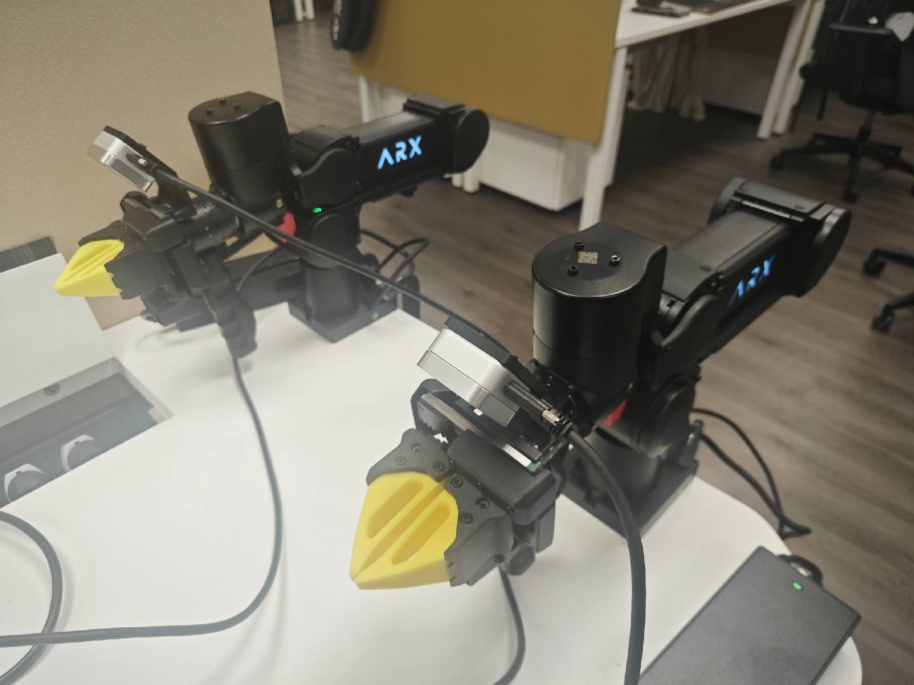
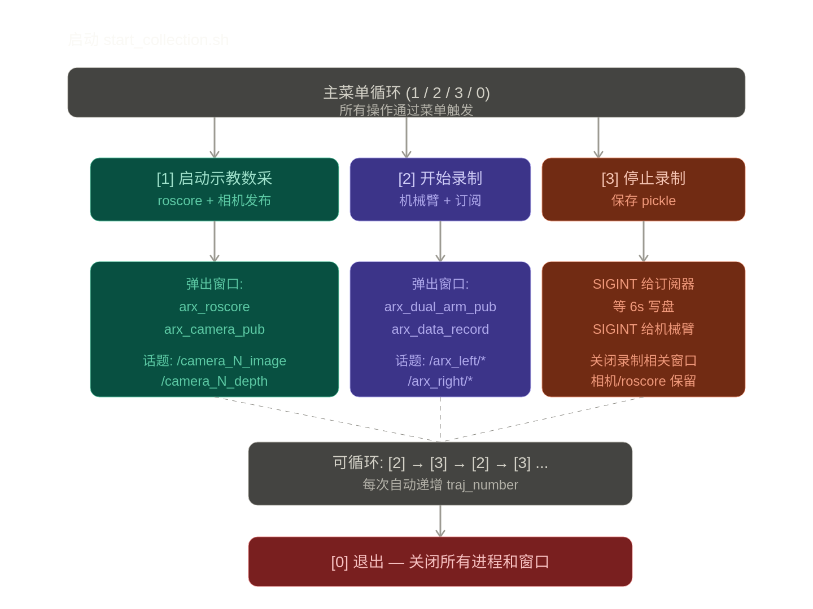

# arx_wrapper：ARX A5 双臂安全封装与数据采集

## 概述

`arx_wrapper` 是 LV Robotics Lab 面向 ARX A5/X5 双臂的标准 wrapper 仓库。它在原交互式示教数采、回放、可视化和训练工具之上，新增了可安装的 `src/arx_wrapper` Python 包、类型化配置、只读 `doctor`、延迟加载 SDK、显式运动安全门和无硬件单测。X5 controller API 位于 `arx_wrapper.x5`，与 ROS、Hydra 和 Prometheus 解耦。

仓库由 `ARX_A5_Dual_ARM` 更名而来；已有 `A5/`、`data_collection/`、`data_replay/`、数据格式和 `dual_arm_sys.sh` 入口继续保留。新代码统一使用 `import arx_wrapper`。架构、迁移和上游维护边界分别见 [`docs/ARCHITECTURE.md`](./docs/ARCHITECTURE.md)、[`docs/MIGRATION.md`](./docs/MIGRATION.md) 和 [`docs/UPSTREAM.md`](./docs/UPSTREAM.md)。英文概览见 [`README_EN.md`](./README_EN.md)。

### Wrapper 快速验证（不连接硬件）

```bash
python -m pip install -e '.[dev,replay]'
arx-config
arx-doctor
pytest
```

`arx-doctor` 默认只报告，不会启动 CAN、导入 ARX 二进制或发运动命令。真实回放默认关闭；只有同时给出 `--execute --clearance-confirmed --estop-ready --exclusive-control-confirmed` 才允许进入硬件路径。软件门通过不代表物理硬件验收完成。

### X5 controller 安装（Linux 机械臂工作站）

```bash
git submodule update --init third_party/arx5-sdk
python -m pip install -e '.[x5]'
./scripts/install_x5_sdk.sh
```

`X5DualArm(...)` 的构造和模块导入都不会加载 `arx5_interface` 或连接 CAN；
只有 `connect()` 会加载 SDK，并在双侧 controller 建立后立即通过无需运动授权的
`safe_stop()` 进入 damping，成功返回时绝不处于未知模式。所有运动、回零和模式命令默认由
`MotionGate()` 拒绝。无需运动授权的 `safe_stop()`/`close()` 只请求
damping 并释放资源，绝不会自动回零。安装和离线测试不等于真实硬件验收。




## 安装
请参考 [A5 SDK 安装文档](./A5/README.md) 安装好 ARX A5双臂机械臂。官方仓库请参考：[https://github.com/ARXroboticsX/A5](https://github.com/ARXroboticsX/A5)。另外，你还需要以下必须的软件包：

```bash
pip install -e '.[collection,realsense,replay]'
cp config/arx.env.example config/arx.local.env
```

> `h5py` 用于深度图的分块流式写盘(`<cam>_depth.h5`),避免长录制把内存撑爆。

> `rerun-sdk` 必须锁在 0.20 之前的版本。0.20+ 依赖 numpy 2.0,会和 RoboStack 用 numpy 1.x ABI 编译的 `cv_bridge` 冲突,导致 `data_record.py` 启动失败。


## 启动

```bash
conda activate robo_ctrl
cd ~/workspace/arx_wrapper
./dual_arm_sys.sh
```

启动后会进入交互菜单:

```
=== ARX 双臂数据采集系统 / ARX Dual-Arm Data Collection System ===
任务 / Task: egg_to_bowl    有效 / Valid: 99    失败 / Failed: 13
1. 启动示教数采 / Start teaching environment (CAN + roscore + camera)
2. 开始录制数据 / Start recording (arm teaching + data subscriber)
3. 停止录制数据 / Stop recording (finalize files + 询问是否保留)
4. 可视化轨迹 / Visualize episode (Rerun)
0. 退出并关闭所有终端 / Exit and close all terminals
请选择 / Select:
```

> **任务隔离**:菜单顶部的 `Task: <name>` 决定数据落在 `$HOME/workspace/raw_data/<TASK_NAME>/` 下。默认 `egg_to_bowl`,采新任务前用 `TASK_NAME=xxx ./dual_arm_sys.sh` 启动,避免和已有数据共用 traj 编号空间。

## 操作步骤

### 步骤 1:首先选择 [1] 启动示教数采

**功能**:启动数据采集所需的基础环境,只需启动一次,后续所有录制都复用。

**会启动的进程和窗口**:

| 弹出窗口标题 | 启动的进程 | 作用 |
|---|---|---|
| `arx_canpub_can1` | `sudo arx_can1` (CAN watchdog) | 左臂 CAN 接口拉起 + 断线重连;`sudo -n` 启动,需配置 NOPASSWD |
| `arx_canpub_can3` | `sudo arx_can3` (CAN watchdog) | 右臂 CAN 接口同上 |
| `arx_roscore` | `roscore` | ROS Master,所有话题通信的中枢 |
| `arx_camera_pub` | `python realsense_pub_node.py` | RealSense 多相机发布,按 USB serial 硬绑定到逻辑名 |

**发布的话题**(按相机逻辑名):

- `/cam_top_image`、`/cam_top_depth` — 顶视 L515
- `/cam_left_wrist_image`、`/cam_left_wrist_depth` — 左腕 D405
- `/cam_right_wrist_image`、`/cam_right_wrist_depth` — 右腕 D405

> serial → 名字的映射来自忽略提交的 `config/arx.local.env`。换相机时必须先核对实物标签，再更新 `ARX_CAM_*_SERIAL`，否则录到的数据 `cam_top` 可能是腕上那只。

完成后控制台会提示「示教环境就绪」。如果 CAN 没起来(常见原因:`sudo -n` 没配 NOPASSWD)脚本会直接 abort,不会进入下一步。

### 步骤 2:选择 [2] 开始录制数据

**功能**:启动机械臂示教和数据订阅器,开始记录一条新轨迹。

**前置条件**:必须先执行过步骤 1,否则会提示 roscore 未运行。

启动机械臂发布器前，菜单会要求逐项确认清场、急停和独占控制，并输入 `TEACH`。取消或输入不匹配时不会连接机械臂。

**会启动的进程和窗口**:

| 弹出窗口标题 | 启动的进程 | 作用 |
|---|---|---|
| `arx_dual_arm_pub` | `python dual_arm_ctrl.py` | 双臂进入重力补偿模式,实时发布关节状态和末端位姿 |
| `arx_data_record` | `python data_record.py --root_dir=... --traj_number=N` | 订阅所有话题,缓存到内存,等待结束信号统一保存 |

**轨迹编号**:新编号 = `max(已有 NNNN) + 1`,从 0000 起。**不**用「目录数量」做编号 —— 那样删一个失败 episode 后下一条会跟现存数据撞号覆盖。失败 episode 移走时它的槽位会被复用(详见步骤 3)。

**发布的话题**(由机械臂发布器):

- `/arx_left/joint_states`、`/arx_left/eef_pose`
- `/arx_right/joint_states`、`/arx_right/eef_pose`

此时手动拖动两条机械臂进行示教,所有数据会被订阅器持续记录到内存。

### 步骤 3:选择 [3] 停止录制数据

**功能**:结束本次录制,保存 pickle,关闭机械臂和录制相关的两个窗口。

**操作流程**(脚本自动执行):

1. 给订阅器发送 `SIGINT`,触发其内部 `signal_handler` → finalize 流式写盘:
   - `<cam>_rgb.mp4` — 每相机一个 mp4(录制过程中已逐帧写入,这里只是 release writer)
   - `<cam>_depth.h5` — 每相机一个 HDF5(`depth_mm` uint16 + `timestamps_ms` int64)
   - `image_timestamps.pkl` — 每相机的 RGB 帧时间戳
   - `state.pkl` — 双臂关节状态 + 时间戳
   - `eef_pose.pkl` — 双臂末端位姿 + 时间戳
2. 等待最多 30 秒让订阅器收尾完成(实际只需关闭文件句柄,通常 1 秒内)
3. 关闭 `arx_data_record` 窗口
4. 给机械臂发布器发送 `SIGINT`,等 3 秒退出
5. 关闭 `arx_dual_arm_pub` 窗口
6. **询问操作员本次是否有效**:
   - `Y/回车` → 保留为 `$DATA_DIR/NNNN/`
   - `N` → 整目录移到 `$DATA_DIR/_failed/fNNNN/`(独立的 f 编号),原 NNNN 槽位下次 [2] 复用

> 失败 episode 不删除是为了事后排查采集环境问题(相机抖动、关节漂移、夹爪卡顿等)。失败档案不会污染 training pipeline —— 只要扫 `$DATA_DIR/[0-9]*/`,`_failed/` 前缀的下划线让正则跳过。

**保留运行**:`arx_canpub_can*`、`arx_roscore` 和 `arx_camera_pub` 窗口**不会**关闭,可以直接进入下一轮 [2] 录制。

### 循环采集

录制流程可以反复执行:

```
[2] → 拖动示教 → [3] (保存 0000)
[2] → 拖动示教 → [3] (保存 0001)
[2] → 拖动示教 → [3] (保存 0002)
...
```

每次 traj_number 自动递增,数据保存在 `$HOME/workspace/raw_data/<TASK_NAME>/`:

```
$DATA_DIR/0000/
├── cam_top_rgb.mp4              # 720×1280 BGR
├── cam_left_wrist_rgb.mp4       # 480×640 BGR
├── cam_right_wrist_rgb.mp4      # 480×640 BGR
├── cam_top_depth.h5             # 'depth_mm' (uint16, chunked, lzf) + 'timestamps_ms' (int64)
├── cam_left_wrist_depth.h5
├── cam_right_wrist_depth.h5
├── image_timestamps.pkl         # {cam_top: [ms,...], cam_left_wrist: [...], ...}
├── state.pkl                    # {left_arm: {joints:(N,7), timestamps:[ms,...]}, right_arm: ...}
└── eef_pose.pkl                 # {left_arm: {eef_pose:(N,7 = xyz+wxyz), timestamps:[...]}, right_arm: ...}
$DATA_DIR/0001/
...
$DATA_DIR/_failed/f0000/         # 操作员在 [3] 标记失败的 episode 移到这里
$DATA_DIR/_failed/f0001/         # 独立的 f0000、f0001... 编号
...
```

> `joints` 第 7 列是夹爪开度(负值,例如 -2.31),不是第 7 个旋转关节 —— A5 是 6DOF 臂。回放时 `[:, 0:6]` 走 `set_joint_positions`,`[:, 6]` 走 `set_gripper_pos`。

> **流式落盘**:RGB 通过 `cv2.VideoWriter` 逐帧写 mp4,深度通过 `h5py` 分块 append 写 HDF5(`compression='lzf'`,无损,uint16 毫米),内存占用恒定。`SIGINT` 触发后只做 finalize(关闭文件句柄 + 写小 pickle),通常 1 秒内完成。旧版 `image.pkl` / `depth.pkl` 仍能被 `visualize_episode.py` 读出来。

### 选择 [0] 退出并关闭所有终端

**功能**:全部停止,清理所有相关进程和窗口。

**清理顺序**:

1. 数据订阅器(给 6 秒保存数据的时间)
2. 机械臂发布器(3 秒)
3. 相机发布器(1 秒)
4. roscore(1 秒)
5. 关闭所有相关 gnome-terminal 窗口

## 部分技术细节实现

### 进程管理

- 用 **`pkill -f <脚本名>`** 按命令名匹配 Python 进程,不依赖 PID 文件(PID 文件容易和实际进程脱钩)
- 终止信号顺序:**SIGINT → SIGTERM → SIGKILL**,给数据保存留时间,超时再强杀

### 窗口管理

- 在每个 `gnome-terminal` 启动的 bash 命令行里注入 `TITLE_TAG=<窗口名>` 标记
- 关闭时用 `pkill -f "TITLE_TAG=xxx"` 精确命中那个 bash 进程
- 装了 `wmctrl` 的话有兜底:按窗口标题关闭

### 数据时间戳

各路数据流的发布频率不一致(相机 30Hz,关节/eef 60Hz),订阅器**不做时间同步**,每条消息按自带的 `header.stamp` 各自记录。**对齐留到训练时的后处理阶段**,这样:

- 不丢帧
- 训练时可以按需对齐(最近邻、插值、stack 多帧等)
- 调试更容易

## 常见问题

### Q1:按 [2] 提示「roscore 未运行」

先按 [1] 启动示教环境。

### Q2:按 [3] 后窗口没关闭

检查是否安装了 `wmctrl`:

```bash
sudo apt install wmctrl
```

没装也能跑,但窗口可能要等内部 bash 的 `read -n 1` 收到任意键才能关。装了就能自动关。

### Q3:数据没保存或保存的文件很小

检查订阅器窗口的输出。SIGINT 触发后应该看到类似:

```
Received signal 2, finalizing...
Saved to /home/.../raw_data/0007
  camera1 RGB:   245 frames
  camera1 depth: 244 frames
  ...
```

如果数字很小或为 0,说明订阅时根本没有数据 → 可能是相机没启动或机械臂没启动。流式写盘下,采集过程中 `<cam>_rgb.mp4` / `<cam>_depth.h5` 已经在持续增长,可以在另一个终端 `ls -lh $DATA_DIR/NNNN/` 实时观察。

### Q4:连续按两次 [2]

脚本会检测 `data_record.py` 是否已在运行,有则提示「已有录制在运行,请先选 [3]」,不会启动重复进程。

### Q5:如何修改保存路径或切换任务

采新任务直接用环境变量,不要改脚本:

```bash
TASK_NAME=cup_to_shelf ./dual_arm_sys.sh
```

数据会落到 `$HOME/workspace/raw_data/cup_to_shelf/`。每个任务有独立的 traj 编号空间和 `_failed/` 档案,互不干扰。

要换 `raw_data` 根目录就编辑 `dual_arm_sys.sh` 里 `DATA_DIR=` 那行。

### Q6:[1] 报 CAN 启动失败

`ensure_can_up` 用 `sudo -n`(non-interactive)拉起 `arx_canN` watchdog。如果没配 NOPASSWD 它会立刻退出,弹出的 `arx_canpub_canX` 窗口会打印 sudo 错误。修法:

```bash
sudo visudo
# 加一行(替换 USERNAME):
USERNAME ALL=(ALL) NOPASSWD: /home/USERNAME/workspace/arx_wrapper/A5/ARX_CAN/arx_can1, /home/USERNAME/workspace/arx_wrapper/A5/ARX_CAN/arx_can3
```

或者手动 `sudo $PROJ/A5/ARX_CAN/arx_can1`、`arx_can3` 起一次,`[1]` 检测到接口已 UP 会跳过启动。

### Q7:相机 serial 不在配置里

换了相机/新机器会报 `WARNING: unknown camera serial(s) — skipped`。把经实物核对的新 serial 写入 `config/arx.local.env` 的 `ARX_CAM_TOP_SERIAL`、`ARX_CAM_LEFT_WRIST_SERIAL` 或 `ARX_CAM_RIGHT_WRIST_SERIAL`。这个绑定必须做,否则 USB 枚举顺序会让顶视图和腕视图随机交换。

## 数据可视化

每条轨迹保存为 `$DATA_DIR/NNNN/` 下的若干文件(`<cam>_rgb.mp4` + `<cam>_depth.h5` + `image_timestamps.pkl` + `state.pkl` + `eef_pose.pkl`)。用 [Rerun](https://rerun.io) 可视化最简单的方式就是在主菜单里选 [4],输入轨迹编号:

- 留空 → 最近一条**有效**轨迹(自动跳过 `_failed/`)
- `7` 或 `0007` → 编号 7 的有效轨迹
- `f7` 或 `f0007` → `_failed/f0007/` 失败档案

或者直接命令行启动:

```bash
conda activate robo_ctrl
cd ~/workspace/arx_wrapper/data_collection
python visualize_episode.py ~/workspace/raw_data/egg_to_bowl/0000
```

会弹出 Rerun viewer:三个相机的 RGB+Depth、左右臂关节角时序曲线、末端位姿在 3D 世界坐标系下的轨迹,全部按 `header.stamp` 对齐到同一条时间线(时间轴会归一到 episode 起点,所以拖动浮标的范围总是从 0s 开始)。

常用选项:
- `--no-depth` 跳过深度,内存占用减半,启动更快
- `--save ep.rrd` 把数据导出成 `.rrd` 文件,之后用 `rerun ep.rrd` 离线打开,适合发给同事
- `--connect 127.0.0.1:9876` 推到一个已经开着的 viewer

文件部分损坏(比如 `.pkl` 被截断)时脚本会跳过那一路,只可视化能读出来的部分。

## 数据验证(回放)

可视化只看记录到的数,**回放**才能验证记录到的数能否真复现在物理臂上 —— 一段拖动示教数据要是 replay 时撞桌子/抖飞,Rerun 看起来再漂亮也用不了。

操作流程和详细安全注意事项见 [`data_replay/README.md`](./data_replay/README.md)。要点:

- 回放前用 `[1]` 拉起 CAN(不需要 [2],也不需要 roscore/相机)
- **第一次跑必须清场 + 手放急停按钮**:首帧从当前姿态到 `joints[0]` 会插值过渡,但臂仍可能朝意外方向走
- 建议先用 `--no-left`（仅右臂）或 `--no-right`（仅左臂）验证再上双臂
- 失败 episode (`_failed/`) 通常 replay 也会失败,不要拿它做首测

## 文件结构

```
arx_wrapper/
├── pyproject.toml                  # arx-wrapper 安装、CLI、测试和 lint 配置
├── src/arx_wrapper/                # 类型化配置、只读 doctor、SDK 生命周期和安全门
├── config/arx.env.example          # 本机 CAN/相机配置模板（local 文件不入 Git）
├── tests/                          # 无 ROS/无 CAN/无真实硬件单测
├── docs/                           # 架构、迁移和上游维护边界
├── dual_arm_sys.sh                 # 启动脚本(根目录,管 CAN + roscore + 采集 + 可视化)
├── data_collection/                # 采集端(写数据)
│   ├── dual_arm_ctrl.py            # 双臂重力补偿 + 发布 joint/eef
│   ├── realsense_pub_node.py       # RealSense 多相机发布(读取 serial → 逻辑名配置)
│   ├── data_record.py              # 订阅所有话题 + 流式落盘
│   └── visualize_episode.py        # Rerun 可视化
├── data_replay/                    # 验证端(读数据 + 控臂)
│   ├── replay_episode.py           # 读 state.pkl 回放,验证采集质量
│   └── README.md                   # 回放专用文档(前置条件/安全/故障排查)
└── A5/
    ├── bimanual/                   # ARX SDK (SingleArm / DualArm 封装)
    └── ARX_CAN/                    # CAN watchdog 脚本 (arx_can1, arx_can3)
```
